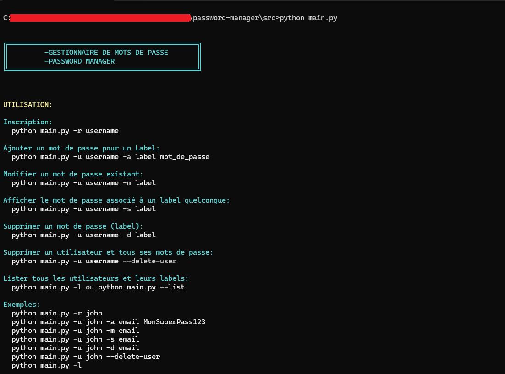

# 🔐 Password Manager 
Un **gestionnaire de mots de passe en ligne de commande** (CLI) développé en **Python**, utilisant **SQLite** pour le stockage et **AES-256** pour le chiffrement des mots de passe.  
Le but est de comprendre les bases de la **cryptographie appliquée**, de la **gestion sécurisée des utilisateurs** et de la **protection des données sensibles**.

---

## 📁 Structure du projet

```
password-manager/
├── db/
│   └── data.sqlite          # Base de données SQLite
└── src/
    ├── .env.example         # Exemple de configuration d'environnement
    ├── cli.py               # Interface en ligne de commande
    ├── crypto.py            # Fonctions de chiffrement et dérivation de clés
    ├── database.py          # Gestion de la base de données SQLite
    ├── main.py              # Point d'entrée principal du programme
    ├── requirements.txt     # Dépendances Python
    └── __pycache__/         # Cache Python (auto-généré)
```



---

## ⚙️ Installation

### 1️⃣ Cloner le projet
```bash
git clone https://github.com/SMoctarL/PasseWord_Manager.git
cd password-manager/src
```

### 2️⃣ Créer un environnement virtuel
```bash
python -m venv venv
source venv/bin/activate   # Linux / Mac
venv\Scripts\activate      # Windows
```

### 3️⃣ Installer les dépendances
```bash
pip install -r requirements.txt
```

### 4️⃣ Créer la base de données
```bash
python main.py
```

---

## 🚀 Utilisation

### 🧍 Enregistrer un utilisateur
```bash
python main.py -r <USERNAME>
```

### ➕ Ajouter un mot de passe
```bash
python main.py -u <USERNAME> -a <LABEL> <PASSWORD>
```

### 🔍 Afficher un mot de passe
```bash
python main.py -u <USERNAME> -s <LABEL>
```

### ✏️ Modifier un mot de passe
```bash
python main.py -u <USERNAME> -m <LABEL>
```

### 🗑️ Supprimer un mot de passe
```bash
python main.py -u <USERNAME> -d <LABEL>
```

### ⚠️ Supprimer un utilisateur
```bash
python main.py -u <USERNAME> --delete-user
```

### 📊 Lister tous les utilisateurs
```bash
python main.py -l
```

---

## 🧠 Fonctionnement interne

| Module | Rôle |
|--------|------|
| **crypto.py** | Gère le chiffrement AES-256 (CBC) et la dérivation de clé PBKDF2. |
| **database.py** | Initialise et gère la base SQLite. Stocke les utilisateurs, mots de passe chiffrés et tentatives de connexion. |
| **cli.py** | Fournit l'interface utilisateur via la ligne de commande (argparse). |
| **main.py** | Point d'entrée du programme, relie tout le système. |

---

## 🔒 Sécurité intégrée

### Cryptographie
- 🔑 **Hachage SHA-256** du mot de passe maître (avec salt unique).
- 🔐 **Chiffrement AES-256 (CBC)** des mots de passe stockés.
- 🧂 **Salt aléatoire** généré pour chaque utilisateur et mot de passe.
- 🔄 **PBKDF2** avec 100 000 itérations pour la dérivation de clés.
- 🚫 Aucun mot de passe en clair n'est stocké dans la base de données.

### Protections supplémentaires
- 🛡️ **Confirmation double** du mot de passe lors de l'inscription et modification.
- ⚠️ **Détection de réutilisation** : Alerte si un mot de passe existe déjà pour un autre label.
- 🔐 **Limitation des tentatives** : Blocage temporaire après 3 échecs de connexion (15 minutes).
- 🗝️ **Confirmation renforcée** pour la suppression d'utilisateur (retaper le nom d'utilisateur).

---

## 📋 Fonctionnalités

- ✅ Inscription et authentification des utilisateurs
- ✅ Ajout de mots de passe pour un label (avec confirmation de saisi)
- ✅ modification de mots de passe pour un label
- ✅ suppression de mots de passe pour un label
- ✅ Affichage sécurisé des mots de passe
- ✅ Liste complète des utilisateurs et leurs labels
- ✅ Détection automatique de la réutilisation de mots de passe dans deux labels differentes afin d'augmenter la sécurité
- ✅ Interface en couleurs pour une meilleure lisibilité
- ✅ Statistiques du système (nombre d'utilisateurs, labels, etc.)

---

## 📝 Exemples

### Workflow complet
```bash
# Créer un utilisateur
python main.py -r john

# Ajouter des mots de passe
python main.py -u john -a email Pass123
python main.py -u john -a facebook SecurePass456

# Lister les utilisateurs
python main.py -l

# Afficher un mot de passe
python main.py -u john -s email

# Modifier un mot de passe
python main.py -u john -m email

# Supprimer un mot de passe
python main.py -u john -d facebook

# Supprimer l'utilisateur
python main.py -u john --delete-user
```

---